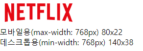
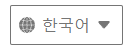
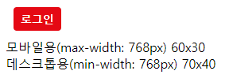
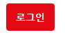
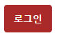
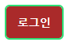

# 헤더 영역

## 로고

  - 반응형으로 모바일용 로고(좌) 사이즈 및 데스크톱용 로고(우) 사이즈 가변

## 셀렉터

  - 반응형으로 모바일용 셀렉터(좌) 사이즈 및 데스크톱용 셀렉터(우) 사이즈 가변
  - 한국어 option 태그의 atrribute selected로 지정하여 기본값으로 설정

  - focus 시 outline

## 로그인 버튼

  - 반응형으로 모바일용 로그인 버튼(좌) 사이즈 및 데스크톱용 로그인 버튼(우) 사이즈 가변
  - 클릭 시 로그인 페이지로 이동되게끔 a 태그 사용

  - hover, focus 시 살짝 어둡게 처리

  - focus 시 outline