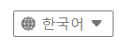
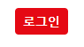

# 헤더 영역

 - **모바일용**

  - **데스크톱용**

## 로고
 - **모바일용**

 - **데스크톱용**

## 셀렉터
 - **모바일용**

 - **데스크톱용**

한국어 option 태그의 atrribute selected로 지정하여 기본값으로 설정

  - **focus 시 outline**

## 로그인 버튼
 - **모바일용**

 - **데스크톱용**

클릭 시 로그인 페이지로 이동되게끔 a 태그 사용

  - **hover, focus 시 살짝 어둡게 처리**

  - **focus 시 outline**

